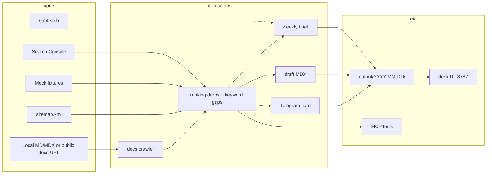

# ProtocolOps

DeFi docs SEO & content agent for [Kevin Lance Murray](https://github.com/HEADWOPZ) / HEADWOPZ.

Hermes-style weekly operator: read [Google Search Console](https://search.google.com/search-console) (optional GA4), crawl a Mintlify / Docusaurus / GitBook-style docs tree, and ship **SEO briefs**, **draft MDX pages**, and a **Telegram report card**. Packaged as a CLI, a dark status desk, MCP tools, and a skill pack.

ProtocolOps writes drafts. A human reviews them. It does not publish, buy links, or send traffic.

## Architecture



| Piece | Role |
| --- | --- |
| `protocolops.connectors.gsc` | Search Analytics, two windows. Service account, OAuth token, or mock fixtures. |
| `protocolops.connectors.ga4` | Env-gated stub (`PROTOCOLOPS_GA4=true`). Fixture metrics in v1. |
| `protocolops.crawler` | Local `.md` / `.mdx` walk + optional remote sitemap crawl. Titles, headings, slugs. |
| `protocolops.seo` | Ranking drops, coverage gaps, CTR opportunities, brief + MDX renderer. |
| `protocolops.jobs.weekly` | Orchestrates a dated output folder + suggested PR body. |
| `protocolops.mcp_server` | MCP tools on stdio. |
| `protocolops.desk` | Minimal dark UI for the last brief and drafts. |

## Quick start (mock mode)

Mock mode is the default. No Google credentials required — local work and CI use `fixtures/`.

```bash
python3 -m venv .venv
source .venv/bin/activate
pip install -e ".[dev]"
cp .env.example .env

protocolops run --weekly
protocolops status
protocolops desk          # http://127.0.0.1:8787
```

A successful weekly run writes:

```
output/YYYY-MM-DD/
  weekly-brief.md
  drafts/*.mdx            # 2–3 gap-targeted stubs
  sitemap-report.json
  docs-index.json
  telegram-report.md      # dry-run card
  suggested-pr.md         # human-reviewed PR body only
  run.json
output/latest.json
```

Sample corpus: `fixtures/docs` (Helios Protocol — fictional liquid-staking docs). Fixture GSC rows live in `fixtures/gsc/search_analytics.json`.

## CLI

```text
protocolops run --weekly          # full weekly pack
protocolops crawl                 # print the docs index
protocolops gsc-summary           # Search Console rollup
protocolops auth                  # installed-app OAuth (needs a browser)
protocolops desk                  # status UI
protocolops mcp                   # MCP server on stdio
protocolops status                # latest run pointer
protocolops version
```

`--live-telegram` on `run --weekly` is the only way the job POSTs to Telegram. Without a bot token it still dry-runs.

## MCP tools

Start the server with `protocolops mcp` (stdio). Register it in Claude / Cursor / Hermes:

```json
{
  "mcpServers": {
    "protocolops": {
      "command": "protocolops",
      "args": ["mcp"]
    }
  }
}
```

| Tool | What it does |
| --- | --- |
| `gsc_summary` | Clicks, impressions, top queries, position deltas. Mock-safe. |
| `docs_index` | Crawl local folder or `PROTOCOLOPS_DOCS_URL`. |
| `seo_brief` | Weekly brief. `write=true` persists the pack. |
| `draft_mdx` | One MDX stub. Pass `query` or take the top gap. |
| `send_report` | Telegram card. **`dry_run` defaults to true.** |

Tool implementations live in `src/protocolops/tools.py` so they can be unit-tested without a stdio session.

## Skill pack

Hermes / Claude / Cursor weekly operator:

- [`skills/protocolops-weekly/SKILL.md`](skills/protocolops-weekly/SKILL.md)
- [`.cursor/skills/protocolops-weekly/SKILL.md`](.cursor/skills/protocolops-weekly/SKILL.md)

Follow that skill for the weekly run. It forbids auto-merge and traffic tricks.

## Google Search Console

The Search Console API is read-only (`webmasters.readonly`). ProtocolOps never writes sitemaps or inspects URLs on your behalf.

### Mock

Leave `PROTOCOLOPS_MOCK=true` (default) or omit credentials. The connector loads `fixtures/gsc/search_analytics.json`.

### Service account

1. Create a GCP project and enable **Search Console API**.
2. Create a service account and download the JSON key.
3. In Search Console → Settings → Users, add the service account email (`...@....iam.gserviceaccount.com`) as a full user on the property.
4. Point the runtime at the key and the property:

```bash
export GOOGLE_APPLICATION_CREDENTIALS=/absolute/path/to/service-account.json
export PROTOCOLOPS_SITE_URL=https://docs.yourprotocol.example/
export PROTOCOLOPS_MOCK=false
protocolops gsc-summary
```

### OAuth (desktop client)

1. GCP → APIs & Services → Credentials → Create **OAuth client ID** → Desktop app. Download the client JSON.
2. Add your Google account as a Search Console user on the property (if it is not the owner already).
3. On a machine with a browser:

```bash
export GSC_OAUTH_CLIENT_FILE=/absolute/path/to/oauth-client.json
export GSC_TOKEN_FILE=.protocolops/token.json
protocolops auth
export PROTOCOLOPS_MOCK=false
export PROTOCOLOPS_SITE_URL=https://docs.yourprotocol.example/
```

`auth` opens a local callback, stores a refreshable token at `GSC_TOKEN_FILE` (gitignored), and later runs reuse it.

If live fetch fails, the weekly job records the error in `notes` and falls back to fixtures so the pack still ships.

### Property URL

`PROTOCOLOPS_SITE_URL` must match the Search Console property exactly, including the trailing slash for URL-prefix properties (`https://docs.example.com/`). Domain properties use `sc-domain:example.com`.

## Optional GA4

GA4 is off until `PROTOCOLOPS_GA4=true`. v1 is a stub: it loads `fixtures/ga4/engagement.json` and, if `GA4_PROPERTY_ID` is set, tells you live `runReport` is not wired. The brief includes a GA4 section only when the flag is on.

## Docs crawler

- **Local:** `PROTOCOLOPS_DOCS_PATH` (default `fixtures/docs`). Walks `.md`, `.mdx`, `.markdown`. Reads YAML frontmatter (`title`, `slug`, `description`, `keywords` / `tags`), ATX headings, and first paragraph.
- **Remote:** set `PROTOCOLOPS_DOCS_URL`. Discovers `sitemap.xml` / `robots.txt` Sitemap lines, then parses HTML titles/H1–H3 or raw markdown.

Sitemap helpers compare crawled slugs to `fixtures/sitemap.xml` (and the remote sitemap when configured). The weekly report lists docs missing from the sitemap and sitemap URLs with no source page.

## Environment

See [`.env.example`](.env.example). Important knobs:

| Variable | Default | Purpose |
| --- | --- | --- |
| `PROTOCOLOPS_MOCK` | `true` | Force fixture GSC even if credentials exist. |
| `PROTOCOLOPS_SITE_URL` | `https://docs.helios.example/` | Search Console property / canonical docs origin. |
| `PROTOCOLOPS_DOCS_PATH` | `fixtures/docs` | Local docs tree. |
| `PROTOCOLOPS_DOCS_URL` | unset | Optional public docs origin to crawl. |
| `PROTOCOLOPS_OUTPUT_DIR` | `output` | Weekly artifacts. |
| `PROTOCOLOPS_BRAND` | `Helios Protocol` | Brief and draft voice. |
| `PROTOCOLOPS_DRAFT_COUNT` | `3` | Max new MDX stubs per week. |
| `GSC_OAUTH_CLIENT_FILE` | unset | Desktop OAuth client JSON. |
| `GSC_TOKEN_FILE` | `.protocolops/token.json` | Saved OAuth token. |
| `GOOGLE_APPLICATION_CREDENTIALS` | unset | Service-account JSON. |
| `PROTOCOLOPS_GA4` | `false` | Include GA4 stub section. |
| `GA4_PROPERTY_ID` | unset | Reserved for a future live adapter. |
| `TELEGRAM_BOT_TOKEN` / `TELEGRAM_CHAT_ID` | unset | Live send only with `--live-telegram`. |
| `PROTOCOLOPS_DESK_HOST` / `_PORT` | `127.0.0.1` / `8787` | Status UI. |

## Desk

`protocolops desk` serves a dark status page: last run id, mock/live badge, click/impression totals, the weekly brief, and a draft previewer. It reads `output/latest.json`. It does not edit files.

## Tests

```bash
pytest
ruff check src tests
```

CI (`.github/workflows/ci.yml`) installs the package, lints, tests, and runs `protocolops run --weekly` in mock mode.

## Not in v1

- Multi-client content calendars
- Link buying or paid placements
- Fake traffic, cloaking, doorway pages
- Auto-merge to the docs repo (draft files + `suggested-pr.md` only)

## Disclaimer

ProtocolOps is an editorial aid. Output is **not financial advice** and not a recommendation to buy, stake, or use any token. Search Console data belongs to the property owner — treat it as confidential. Do not use this tool to manipulate search rankings. Draft pages can be wrong about protocol mechanics; engineering and legal review are mandatory before publish.

## License

[MIT](LICENSE) © 2026 Kevin Lance Murray / HEADWOPZ
